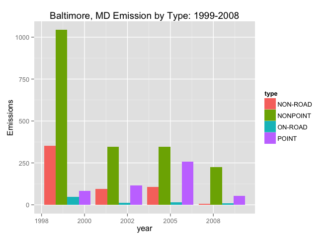
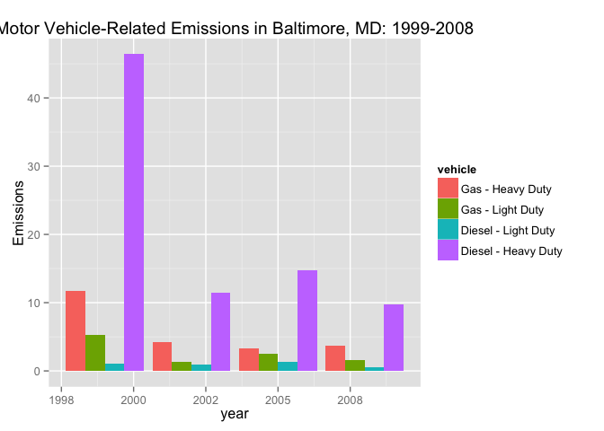
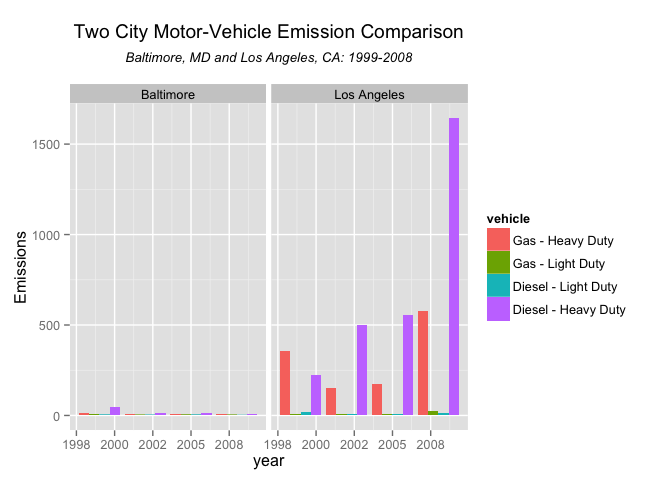

#Exploratory Data Analysis
##Course Project 2: Full Project Document


###Introduction

Fine particulate matter (PM2.5) is an ambient air pollutant for which there is strong evidence that it is harmful to human health. In the United States, the Environmental Protection Agency (EPA) is tasked with setting national ambient air quality standards for fine PM and for tracking the emissions of this pollutant into the atmosphere. Approximatly every 3 years, the EPA releases its database on emissions of PM2.5. This database is known as the National Emissions Inventory (NEI). You can read more information about the NEI at the [EPA National Emissions Inventory web site](http://www.epa.gov/ttn/chief/eiinformation.html).


For each year and for each type of PM source, the NEI records how many tons of PM2.5 were emitted from that source over the course of the entire year. The data for this assignment uses years 1999, 2002, 2005, and 2008.

###Data
The data for this assignment are available from the course web site as a single zip file: [Data for Peer Assessment](https://d396qusza40orc.cloudfront.net/exdata%2Fdata%2FNEI_data.zip).  The zip file contains two file: PM2.5 Emissions Data (summarySCC_PM25.rds), containing all of the PM2.5 emissions data for 1999, 2002, 2005, and 2008; and Source Classification Code Table (Source_Classification_Code.rds), a table providing a mapping from the SCC digit strings in the Emissions table to the actual name of the PM2.5 source. 


```r
setwd("~/ExData_Project2")
NEI <- readRDS("exdata-data-NEI_data/summarySCC_PM25.rds")             #PM2.5 Emissions Data
SCC <- readRDS("exdata-data-NEI_data/Source_Classification_Code.rds")  #Source Classification Code
```


###Assignment
The overall goal of this assignment is to explore the National Emissions Inventory database and see what it says about fine particulate matter pollution in the United states over the 10-year period 1999–2008. 


####Questions

**Question 1**:  Have total emissions from PM2.5 decreased in the United States from 1999 to 2008? Using the **base plotting system**, make a plot showing the total PM2.5 emission from all sources for each of the years 1999, 2002, 2005, and 2008.  Save plot as plot1.png.


```r
totalNEI<-tapply(NEI$Emissions, INDEX=NEI$year, sum)     #Sum emissions per year
barplot(totalNEI, main = "Total Emissions by Year", xlab="Year", ylab="Emissions")
```

 

> Yes, total emissions from PM2.5 have decreased in the range 1999-2008.

**Question 2**: Have total emissions from PM2.5 decreased in the Baltimore City, Maryland (fips == "24510") from 1999 to 2008? Use the **base plotting system** to make a plot answering this question.


```r
baltimore<-subset(NEI, NEI$fips==24510)           #Subset Baltimore area
totalBaltimore<-tapply(baltimore$Emissions, INDEX=baltimore$year, sum)   #Sum emissions per year
barplot(totalBaltimore, main="Total Emissions in Baltimore, MD by Year", xlab="Year", ylab="Emissions")
```

 

> Yes, total emissions from PM2.5 in the Baltimore region have also decreased, thought the trend is less clear.  

**Questions 3**:  Of the four types of sources indicated by the type (point, nonpoint, onroad, nonroad) variable, which of these four sources have seen decreases in emissions from 1999–2008 for Baltimore City? Which have seen increases in emissions from 1999–2008? Use the **ggplot2 plotting system** to make a plot answer this question.  Save as plot3.png.


```r
library(ggplot2)
ggplot(data=baltimore, aes(x=year, y=Emissions, fill=type)) +    
  geom_bar(stat="identity", position="dodge") +
  ggtitle("Baltimore, MD Emission by Type: 1999-2008")
```

 

```r
  ## Bar plot of Baltimore data, x-axis = year split by emissions type, y-axis = total     
  ## Emissions.  Add color to separate emissions type and have bars be side-by-side (not stacked)
```

> Nonpoint and non-road emissions have consistently decreased in Baltimore during the period 1999-2008.  On-road emissions are consistently low over the time period.  Point emissions are inconsistent over the time period.     


**Question 4**: Across the United States, how have emissions from coal combustion-related sources changed from 1999–2008?  Save as plot4.png.


```r
greps1<-unique(grep("coal", SCC$EI.Sector, ignore.case=TRUE, value=TRUE))  
     #Isolate instances of "coal" in SCC column EI.Sector

data1<-subset(SCC, EI.Sector %in% greps1)    #Subset SCC by coal labels
coal<-subset(NEI, SCC %in% data1$SCC)        #Subset NEI by data1 overlaps

ggplot(data=coal, aes(x=year, y=Emissions, fill = type)) + 
  geom_bar(stat="identity", position=position_dodge()) + 
  ggtitle("U.S. Coal Combustion-Related Emissions: 1999-2008")
```

 

> Point-source coal emissions have decreased in 2008 compared to previous years, which may be indicative of a downward trend.  Non-point sources are inconsistent along years and more difficult to interpret, but a sharp decline in 2008 may indicate a downward trend as well.


**Questions 5**  How have emissions from motor vehicle sources changed from 1999–2008 in Baltimore City?
Save as plot5.png.


```r
#For purposes of this study, I have defined motor vehicles sources as highway vehicles.  Included categories #are:

# - Mobile – On-road – Diesel Heavy Duty Vehicles
# - Mobile – On-road – Diesel Light Duty Vehicles
# - Mobile – On-road – Gasoline Heavy Duty Vehicles
# - Mobile – On-road – Gasoline Light Duty Vehicles

greps2<-unique(grep("mobile", SCC$EI.Sector, ignore.case=TRUE, value=TRUE))  
    #only need greps2[1:4]

Gas_Heavy<-subset(SCC, EI.Sector %in% greps2[1])  #Subset SCC by Vehicle Type
Gas_Light<-subset(SCC, EI.Sector %in% greps2[2])
Diesel_Light<-subset(SCC, EI.Sector %in% greps2[3])
Diesel_Heavy<-subset(SCC, EI.Sector %in% greps2[4])

gasHeavy<-subset(baltimore, SCC %in% Gas_Heavy$SCC)   #Subset Baltimore by SCC retaining vehicle type 
gasLight<-subset(baltimore, SCC %in% Gas_Light$SCC)
dieselLight<-subset(baltimore, SCC %in% Diesel_Light$SCC)
dieselHeavy<-subset(baltimore, SCC %in% Diesel_Heavy$SCC)

cars1<-data.frame(gasHeavy, vehicle="Gas - Heavy Duty")      #Add vehicle type column to NEI 
cars2<-data.frame(gasLight, vehicle="Gas - Light Duty")
cars3<-data.frame(dieselLight, vehicle="Diesel - Light Duty")
cars4<-data.frame(dieselHeavy, vehicle="Diesel - Heavy Duty")
cars<-rbind(cars1, cars2, cars3, cars4) 

ggplot(data=cars, aes(x=year, y=Emissions, fill=vehicle)) +
  geom_bar(stat="identity", position=position_dodge()) +
  ggtitle("Motor Vehicle-Related Emissions in Baltimore, MD: 1999-2008")
```

 

> Heavy-duty diesel vehicles have shown a sharp decline in PM2.5 emissions over the time period.  Heavy-duty gasoline vehicle emissions have also declined.  Light-duty vehicles of both types remain consistently low.  


**Question 6**:  Compare emissions from motor vehicle sources in Baltimore City with emissions from motor vehicle sources in Los Angeles County, California (fips == "06037"). Which city has seen greater changes over time in motor vehicle emissions?  Save as plot6.png.


```r
LA<-subset(NEI, NEI$fips=="06037") 

LAgasHeavy<-subset(LA, SCC %in% Gas_Heavy$SCC)   #Subset Baltimore by SCC retaining vehicle type 
LAgasLight<-subset(LA, SCC %in% Gas_Light$SCC)
LAdieselLight<-subset(LA, SCC %in% Diesel_Light$SCC)
LAdieselHeavy<-subset(LA, SCC %in% Diesel_Heavy$SCC)

LAcars1<-data.frame(LAgasHeavy, vehicle="Gas - Heavy Duty")      #Add vehicle type column to NEI 
LAcars2<-data.frame(LAgasLight, vehicle="Gas - Light Duty")
LAcars3<-data.frame(LAdieselLight, vehicle="Diesel - Light Duty")
LAcars4<-data.frame(LAdieselHeavy, vehicle="Diesel - Heavy Duty")
carsALL<-rbind(cars, LAcars1, LAcars2, LAcars3, LAcars4) 
carsALL$fips<-gsub("24510", "Baltimore", carsALL$fips)     #Replace fips with city names
carsALL$fips<-gsub("06037", "Los Angeles", carsALL$fips)

ggplot(data=carsALL, aes(x=year, y=Emissions, fill=vehicle)) + facet_grid(.~fips) +
  geom_bar(stat="identity", position=position_dodge()) +
  ggtitle(expression(atop("Two City Motor-Vehicle Emission Comparison", 
                      atop(italic("Baltimore, MD and Los Angeles, CA: 1999-2008")))))
```

 

> Los Angeles has seen greater vehicle emissions change over time, with higher overall emissions as well as higher-trending emissions over time.  


